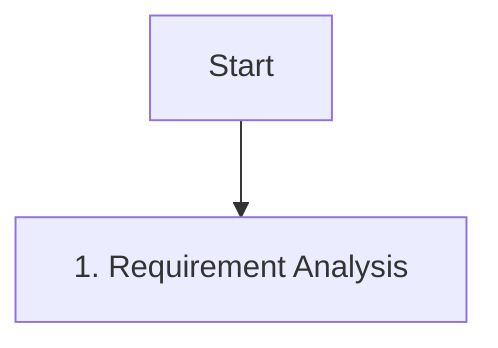
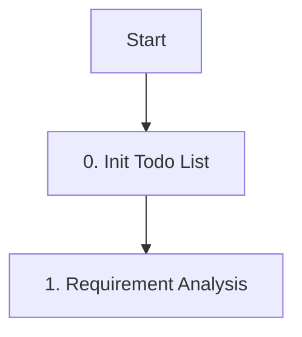
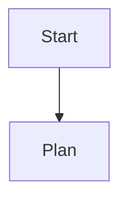
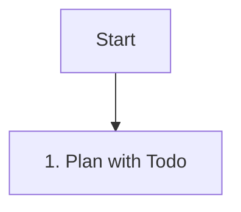

# Design: 워크플로우 그래프 수정 설계

## 1. PM 에이전트 (`pm.md`)
PM의 워크플로우는 이미 복잡하므로, 별도의 노드를 추가하기보다 시작 단계에서 초기화를 강조하는 방식을 택합니다.

### 변경 전

### 변경 후

- `0. Init Todo List` 단계를 추가하여 명시적으로 Todo 작성을 지시합니다.

## 2. 에이전트 템플릿 (`agent-template.md`)
일반적인 에이전트의 워크플로우에도 동일한 패턴을 적용합니다.

### 변경 전

### 변경 후

- `Plan` 노드의 라벨을 `Plan with Todo`로 변경하여 계획 단계의 핵심이 Todo 작성임을 강조합니다. (PM과 달리 단계가 적으므로 통합하는 것이 깔끔함)

## ADDED Requirements
- `pm.md`의 Mermaid 그래프에 `Init[0. Init Todo List]` 노드가 추가되어야 한다.
- `agent-template.md`의 Mermaid 그래프에서 `Plan` 노드가 `Plan[1. Plan with Todo]`로 변경되어야 한다.

#### Scenario: PM 에이전트 시작
1. PM 에이전트가 워크플로우 그래프를 읽음.
2. `Start` -> `Init` 흐름을 확인.
3. `todowrite`를 호출하여 초기 Todo List 작성.
4. `Analysis` 단계로 진입.
