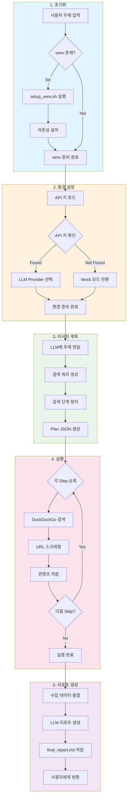
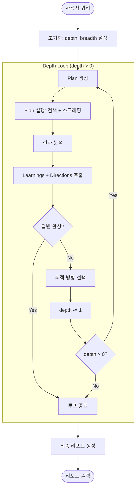

# Deep Research Skill

LLM 기반 자동 심층 리서치. 격리된 venv 환경에서 안전하게 실행됩니다.

## Activation hints

- Trigger keywords: `deep research`, `심층 리서치`, `종합 리포트`, `웹 스크래핑`, `research plan`
- Example phrases: "이 주제를 deep research로 분석해줘", "웹 소스를 모아 심층 리서치 리포트 만들어줘"
- `/deep-research` 는 레거시/예시 커맨드로 문맥상 함께 언급될 수 있습니다.

## 워크플로우



## 디렉토리 구조

```
deep-research/
├── SKILL.md              # 이 문서
├── requirements.txt      # Python 의존성
├── .venv/                # 격리된 가상 환경 (자동 생성)
└── scripts/
    ├── setup_venv.sh     # venv 설정 스크립트
    ├── run_research.sh   # 실행 진입점 (권장)
    ├── run.py            # 메인 Python 스크립트
    ├── load_env.sh       # 환경 변수 로더 (legacy)
    ├── search_engine.py  # 검색 엔진 모듈
    ├── scraper.py        # 웹 스크래퍼 모듈
    ├── llm_client.py     # LLM 클라이언트 모듈
    ├── env_manager.py    # 환경 관리자
    ├── dependency_checker.py # 의존성 검증
    ├── error_handler.py  # 에러 핸들러
    └── test_research.py  # 테스트 코드
```

## 빠른 시작

### 권장 방법: run_research.sh 사용

```bash
# 스킬 디렉토리로 이동
cd ~/.config/opencode/skills/deep-research

# 첫 실행 (자동으로 venv 설정)
./scripts/run_research.sh "AI trends in 2026"

# 또는 명시적으로 설정 후 실행
./scripts/run_research.sh --setup "AI trends in 2026"
```

### 수동 설정

```bash
# 1. venv 설정
./scripts/setup_venv.sh

# 2. venv 활성화
source .venv/bin/activate

# 3. 리서치 실행
python scripts/run.py "AI trends in 2026"

# 4. 완료 후 비활성화
deactivate
```

## 환경 변수

API 키는 다음 우선순위로 자동 로드됩니다:


### 설정 방법

```bash
# Option 1: ~/.config/opencode/.env 파일 (권장)
echo 'GEMINI_API_KEY="your-api-key"' >> ~/.config/opencode/.env

# Option 2: 환경 변수 직접 설정
export GEMINI_API_KEY="your-api-key"
# 또는
export OPENAI_API_KEY="your-api-key"
```

## 사용법

### CLI 옵션

```bash
./scripts/run_research.sh "주제" [옵션]

옵션:
  --breadth N        각 단계당 수집할 URL 수 (기본값: 20)
  --depth N          재귀 탐색 깊이 (기본값: 5, 최대: 5)
  --output-dir DIR   리서치 결과 저장 디렉토리
  --check-only       시스템 준비 상태만 확인
  --setup            실행 전 venv 재설정
  
  # Phase 2 옵션
  --parallel         병렬 스크래핑 활성화 (5-10배 속도 향상)
  --token-budget N   토큰 예산 제한 (기본: 100000)
  --min-trust N      최소 소스 신뢰도 (0.0-1.0, 기본: 0.3)
```

### 실행 모드

#### 1. Classic 모드 (하위 호환)
`--breadth` 없이 `--depth`만 지정하면 기존 단일 패스 모드로 동작합니다.

```bash
# --depth가 URL 수로 해석됨 (기존 동작)
./scripts/run_research.sh "AI trends" --depth 10
```

#### 2. Iterative 모드 (신규)
`--breadth`를 지정하면 재귀적 깊이 탐색이 활성화됩니다.

```bash
# breadth=5 URLs per step, depth=3 iterations
./scripts/run_research.sh "AI trends" --breadth 5 --depth 3
```



### 예시

```bash
# 기본 리서치 (iterative 모드, depth=2)
./scripts/run_research.sh "Climate change solutions"

# 고성능 리서치 (병렬 처리 + 신뢰도 필터)
./scripts/run_research.sh "Quantum computing" --parallel --min-trust 0.7

# 예산 제한 리서치
./scripts/run_research.sh "AI ethics" --token-budget 50000

# Classic 모드 (단일 패스, 5개 URL)
./scripts/run_research.sh "Quantum computing advances" --depth 5

# Iterative 모드 (재귀 탐색)
./scripts/run_research.sh "AI ethics" --breadth 5 --depth 3

# 시스템 상태 확인
./scripts/run_research.sh --check-only

# venv 재설정 후 실행
./scripts/run_research.sh --setup "Machine learning trends"
```

### Python API

```python
from scripts.run import DeepResearch, ResearchState, llm_complete

researcher = DeepResearch(llm_callback=llm_complete)

# Classic 모드
session = researcher.create_plan("Climate change solutions")
results = researcher.execute_plan(session)
report = researcher.generate_report(session, results)

# Iterative 모드
state = ResearchState(
    topic="AI ethics",
    session_id="",
    depth=3,
    breadth=5,
)
final_state = researcher.deep_research(state)
report = researcher.generate_report(
    {"session_id": final_state.session_id, "topic": final_state.topic},
    final_state.all_results
)
```

## 출력

- 리포트: `~/.cache/opencode/research/{session_id}/final_report.md`
- 원본 데이터: `~/.cache/opencode/research/{session_id}/sources/`

## 의존성

```
ddgs>=8.0.0             # DuckDuckGo 검색
beautifulsoup4>=4.12.0
requests>=2.31.0
aiohttp>=3.9.0          # 비동기 HTTP (Phase 2)
google-genai>=1.0.0     # Gemini
openai>=1.0.0           # OpenAI (선택)
```

## 트러블슈팅

### API 키 문제

```bash
# 시스템 상태 확인
./scripts/run_research.sh --check-only

# 환경 변수 확인
echo $GEMINI_API_KEY
```

### 의존성 문제

```bash
# venv 재설정
./scripts/setup_venv.sh --force
```

### 네트워크 문제

```bash
# DuckDuckGo 접속 확인
curl -I https://duckduckgo.com
```

## 보안 고려사항

1. **API 키 격리**: API 키는 환경 변수로만 전달되며, 코드에 포함되지 않습니다.
2. **venv 격리**: 스킬 전용 가상 환경으로 시스템 패키지와 분리됩니다.
3. **캐시 관리**: 리서치 결과는 사용자 캐시 디렉토리에 저장됩니다.

## 관련 스킬

- **research**: 빠른 검색이 필요한 경우
- **memory**: 리서치 결과 장기 저장 시
