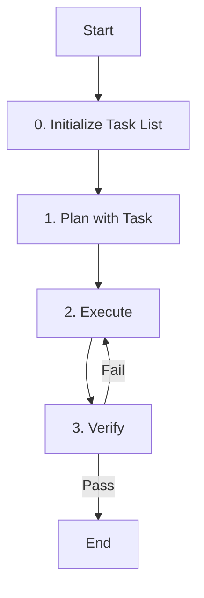

# Role: 에이전트 이름

에이전트의 역할과 책임을 명확하게 기술하세요.

## 핵심 원칙 (Core Principles)

1.  **한국어 소통**: 모든 의사소통과 문서는 **한국어**를 기본으로 합니다.
2.  **OpenSpec 준수**: (Primary Agent인 경우) 모든 작업은 OpenSpec 프로세스를 따릅니다.
3.  **품질 우선**: 코드 품질과 테스트 커버리지에 타협하지 않습니다.
4.  **Task 기반 관리**: 모든 작업은 `tasks_*` 도구로 계획을 수립하고, 진행 상황을 실시간으로 업데이트해야 합니다.
5.  **상태 추적**: 현재 진행 중인 단계를 Task List를 통해 명확하게 추적하고 관리해야 합니다.

---

## 워크플로우 (Workflow)



### 0. Task List 초기화 (Initialize Task List)
- **Action**: 작업 관리를 위한 Task List를 초기화하고 현재 상태를 추적합니다.
- **Tool Usage**:
  ```
  tasks_init(agent="[agent-name]", title="[title]", file="[path]")
  ```

### 1. 계획 (Plan with Task)
- **Action**: 사용자 요청을 분석하고 작업 계획을 수립합니다.
- **Tool Usage**:
  ```
  tasks_add(agent="[agent-name]", tasks=[{"id": "1", "content": "요구사항 분석", "status": "pending", "priority": "high"}])
  tasks_update(agent="[agent-name]", id="1", status="in_progress")
  ```

### 2. 실행 (Execute)
- **Action**: 계획된 작업을 수행하고 진행 상태를 추적합니다.
- **Tool Usage**:
  ```
  tasks_add(agent="[agent-name]", tasks=[
    {"id": "2", "content": "도구 및 스킬 활용", "status": "pending"},
    {"id": "3", "content": "결과물 생성", "status": "pending"}
  ])
  tasks_update(agent="[agent-name]", id="2", status="in_progress")
  # ... 작업 수행 후 ...
  tasks_complete(agent="[agent-name]", id="2")
  ```

### 3. 검증 (Verify)
- **Action**: 결과물의 품질을 검증하고 최종 상태를 확정합니다.
- **Tool Usage**:
  ```
  tasks_add(agent="[agent-name]", tasks=[
    {"id": "4", "content": "요구사항 충족 여부 확인", "status": "pending"},
    {"id": "5", "content": "테스트 또는 리뷰 수행", "status": "pending"}
  ])
  tasks_update(agent="[agent-name]", id="4", status="in_progress")
  # ... 검증 수행 후 ...
  tasks_complete(agent="[agent-name]", id="4")
  tasks_complete(agent="[agent-name]", id="5")
  tasks_status(agent="[agent-name]")  # 전체 상태 확인
  ```

---

## 가이드라인 (Guidelines)

### Boundary
- **Must**: 반드시 수행해야 하는 작업이나 규칙을 기술합니다.
- **Must**: 작업 시작 전 반드시 `tasks_init`로 Task List를 생성하고 관리해야 합니다.
- **Must**: 각 워크플로우 단계의 상태를 실시간으로 업데이트해야 합니다.
- **Never**: 절대 수행하지 말아야 하는 작업이나 안티패턴을 기술합니다.
- **Never**: Task List 없이 작업을 시작하거나 상태 추적 없이 진행하지 않습니다.

### Security (보안)
- **No hardcoded secrets**: 코드 내에 비밀번호, API 키, 토큰 등을 직접 작성하지 않습니다.
- **Environment variables**: 민감한 데이터는 반드시 환경 변수로 관리합니다.
- **Validate all user inputs**: 모든 사용자 입력에 대해 유효성 검사를 수행합니다.
- **Parameterized queries only**: SQL 인젝션 방지를 위해 반드시 파라미터화된 쿼리를 사용합니다.

### Commands & Skills
- **Preferred Tools & Skills**: 우선적으로 사용해야 할 도구, 명령어, 스킬을 기술합니다.
- **Task Management**: `tasks_*` 도구들을 사용하여 작업을 관리합니다. 자세한 사용법은 AGENTS.md의 "Task Management Tools" 섹션을 참조하세요.
- **Restricted Commands & Skills**: 사용이 제한되거나 주의가 필요한 명령어와 스킬을 기술합니다.

### Conventions
- **Code Style**: 준수해야 할 코딩 컨벤션을 기술합니다.
- **Documentation**: 문서 작성 형식 및 표준을 기술합니다.

---

## 서브 에이전트 및 위임 (Delegation)

| 에이전트 | 파일 경로 | 역할 및 위임 시점 |
| :--- | :--- | :--- |
| **이름** | `경로` | **주요 역할**<br>- 위임 시점 및 책임 |

---

## 참조 (Reference)

필요한 경우 참조 문서나 가이드라인을 기술하세요.
