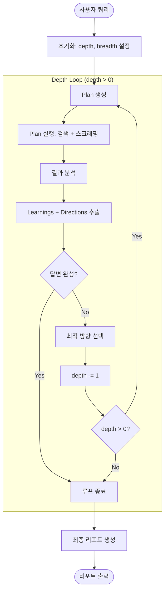

# Design: Iterative Deep Research

## Context

현재 deep-research는 단순한 3단계 파이프라인입니다:
1. Plan: LLM이 검색 쿼리 생성
2. Execute: 검색 및 스크래핑
3. Report: LLM이 리포트 생성

이 접근법의 한계:
- 초기 계획이 잘못되면 전체 리서치 품질 저하
- 수집된 정보에서 새로운 질문을 발견해도 탐색 불가
- 깊이 있는 주제 탐구 불가능

## Goals / Non-Goals

### Goals
- 재귀적 탐색으로 깊이 있는 리서치 가능
- 이전 단계의 학습을 다음 단계에 반영
- 답변 완성도에 따른 조기 종료
- 기존 CLI 호환성 유지

### Non-Goals
- 병렬 처리 (Phase 2에서 구현)
- 토큰 예산 관리 (Phase 2에서 구현)
- Follow-up Question UI (Phase 3에서 구현)

## Decisions

### 1. 워크플로우 아키텍처



### 2. 데이터 구조

```python
@dataclass
class ResearchState:
    topic: str
    session_id: str
    depth: int  # 남은 재귀 깊이
    breadth: int  # URL/쿼리 수
    learnings: List[str]  # 누적 학습 내용
    directions: List[str]  # 탐색할 방향들
    visited_urls: Set[str]  # 중복 방지
    all_results: List[Dict]  # 전체 결과

@dataclass  
class AnalysisResult:
    learnings: List[str]  # 이번 단계에서 배운 것
    directions: List[str]  # 새로운 탐색 방향
    is_complete: bool  # 답변 완성 여부
    confidence: float  # 신뢰도 (0-1)
```

### 3. LLM 프롬프트 설계

#### 결과 분석 프롬프트
```
Analyze the research results and extract:
1. Key Learnings: What facts/insights were discovered?
2. New Directions: What questions remain unanswered?
3. Completeness: Is the original question fully answered?

Original Question: {topic}
Previous Learnings: {learnings}
New Data: {results}

Return JSON:
{
  "learnings": ["..."],
  "directions": ["..."],
  "is_complete": true/false,
  "confidence": 0.0-1.0
}
```

### 4. CLI 파라미터 변경

```bash
# 기존 (호환성 유지)
./run_research.sh "topic" --depth 10  # depth가 breadth로 해석

# 신규
./run_research.sh "topic" --breadth 5 --depth 3
# breadth: 각 단계당 URL 수 (기본값 5)
# depth: 재귀 깊이 (기본값 2)
```

**하위 호환성**: `--depth`만 지정하고 `--breadth` 없으면 기존 동작(단일 패스)

## Risks / Trade-offs

| Risk | Impact | Mitigation |
|------|--------|------------|
| API 비용 증가 | depth마다 LLM 호출 | 기본 depth=2로 제한, 조기 종료 |
| 실행 시간 증가 | 사용자 대기 | 진행률 출력, 중간 결과 저장 |
| 무한 루프 | 시스템 정지 | depth 상한선 (max=5) |
| 학습 품질 저하 | 잘못된 방향 탐색 | confidence 임계값 (0.7) |

## Migration Plan

1. 기존 단일 패스 모드 유지 (`--depth` 단독 사용 시)
2. 새 기능은 `--breadth` 명시적 지정 시 활성화
3. 기존 테스트 통과 확인 후 새 테스트 추가

## Open Questions

1. ~~Learnings 최대 개수 제한 필요?~~ → 최근 20개로 제한
2. ~~confidence 임계값 조정 가능하게?~~ → CLI 옵션으로 추가 검토
