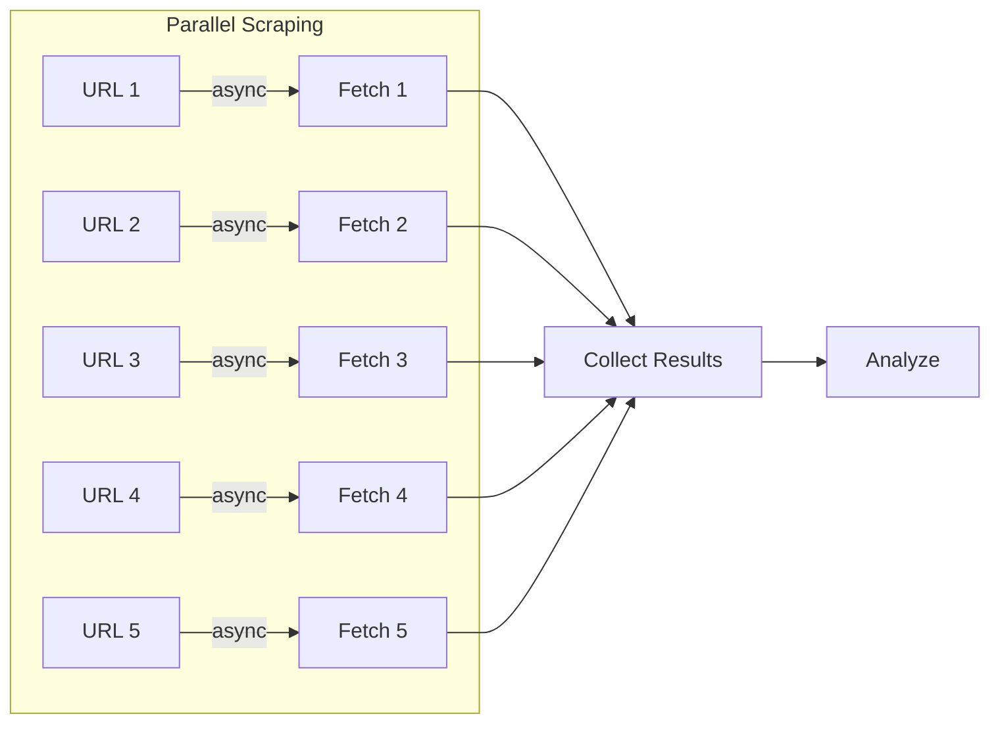

# Design: Deep Research Phase 2 Enhancements

## Context

Phase 1에서 Iterative Deep Research를 구현했습니다. 현재 구조:

```
사용자 쿼리 → Plan → Execute (순차) → Analyze → Recurse → Report
```

Phase 2에서는 성능과 사용성을 개선합니다.

## Goals / Non-Goals

### Goals
- 리서치 속도 5-10배 향상 (병렬 처리)
- 비용 예측 및 제어 (토큰 예산)
- 실시간 진행 상황 표시
- 긴 세션 안정성 향상

### Non-Goals (Phase 3+)
- Multi-Agent 아키텍처
- MCP Tools 통합
- Follow-up Question UI
- Long-Term Memory

## Decisions

### 1. 병렬 스크래핑 아키텍처



```python
# scraper.py 변경
import asyncio
import aiohttp

class AsyncWebScraper:
    def __init__(self, max_concurrent: int = 5, delay: float = 0.5):
        self.semaphore = asyncio.Semaphore(max_concurrent)
        self.delay = delay
    
    async def fetch_all(self, urls: List[str]) -> List[Dict]:
        async with aiohttp.ClientSession() as session:
            tasks = [self._fetch_with_limit(session, url) for url in urls]
            return await asyncio.gather(*tasks, return_exceptions=True)
    
    async def _fetch_with_limit(self, session, url):
        async with self.semaphore:
            await asyncio.sleep(self.delay)  # Rate limiting
            # ... fetch logic
```

### 2. 토큰 예산 관리

```python
@dataclass
class TokenBudget:
    total_limit: int = 100000  # 총 토큰 예산
    used: int = 0
    per_call_limit: int = 10000
    
    def can_continue(self) -> bool:
        return self.used < self.total_limit
    
    def add_usage(self, tokens: int):
        self.used += tokens
    
    def remaining(self) -> int:
        return self.total_limit - self.used

# ResearchState에 추가
@dataclass
class ResearchState:
    # ... 기존 필드 ...
    token_budget: TokenBudget = field(default_factory=TokenBudget)
```

### 3. 진행률 표시 (Rich Library)

```python
from rich.progress import Progress, SpinnerColumn, TextColumn, BarColumn
from rich.console import Console
from rich.live import Live

class ResearchProgress:
    def __init__(self):
        self.console = Console()
        self.progress = Progress(
            SpinnerColumn(),
            TextColumn("[bold blue]{task.description}"),
            BarColumn(),
            TextColumn("{task.completed}/{task.total}"),
        )
    
    def update_depth(self, current: int, total: int):
        # 현재 깊이 표시
        
    def update_urls(self, fetched: int, total: int):
        # URL 페칭 진행률
        
    def show_learnings(self, count: int):
        # 누적 학습 수 표시
```

### 4. 중간 결과 저장 (Checkpoint)

```python
# checkpoint.py
import pickle
from pathlib import Path

class CheckpointManager:
    def __init__(self, session_dir: Path):
        self.checkpoint_file = session_dir / "checkpoint.pkl"
    
    def save(self, state: ResearchState):
        with open(self.checkpoint_file, "wb") as f:
            pickle.dump(state, f)
    
    def load(self) -> Optional[ResearchState]:
        if self.checkpoint_file.exists():
            with open(self.checkpoint_file, "rb") as f:
                return pickle.load(f)
        return None
    
    def clear(self):
        self.checkpoint_file.unlink(missing_ok=True)
```

### 5. Source 신뢰도 평가

```python
# source_evaluator.py
class SourceEvaluator:
    HIGH_TRUST_DOMAINS = {
        "arxiv.org": 0.95,
        "github.com": 0.85,
        "stackoverflow.com": 0.80,
        "docs.python.org": 0.90,
        "developer.mozilla.org": 0.90,
    }
    
    LOW_TRUST_PATTERNS = [
        r".*\.blogspot\.com",
        r".*\.wordpress\.com",
        r"medium\.com/@.*",  # 개인 블로그
    ]
    
    def evaluate(self, url: str) -> float:
        domain = urlparse(url).netloc
        
        # 높은 신뢰도 도메인 체크
        for trusted, score in self.HIGH_TRUST_DOMAINS.items():
            if trusted in domain:
                return score
        
        # 낮은 신뢰도 패턴 체크
        for pattern in self.LOW_TRUST_PATTERNS:
            if re.match(pattern, url):
                return 0.3
        
        return 0.5  # 기본값
```

## CLI 파라미터 추가

```bash
./scripts/run_research.sh "topic" \
    --breadth 5 \
    --depth 3 \
    --parallel          # 병렬 스크래핑 활성화
    --token-budget 50000  # 토큰 예산 (기본: 100000)
    --resume            # 이전 세션 재개
    --min-trust 0.5     # 최소 신뢰도 (기본: 0.3)
```

## 의존성 추가

```
# requirements.txt
aiohttp>=3.9.0      # 비동기 HTTP
rich>=13.0.0        # Progress UI
```

## Risks / Trade-offs

| Risk | Impact | Mitigation |
|------|--------|------------|
| 비동기 코드 복잡성 | 디버깅 어려움 | 충분한 로깅, 동기 폴백 |
| Rate limiting 위반 | IP 차단 | 보수적 지연 설정 (0.5s) |
| 체크포인트 파일 크기 | 디스크 사용량 | 압축, 자동 정리 |
| Rich 의존성 | 설치 복잡성 | 선택적 import |

## Migration Plan

1. 기존 동기 스크래퍼 유지 (폴백)
2. `--parallel` 플래그로 비동기 모드 활성화
3. 기존 테스트 통과 확인
4. 신규 기능 테스트 추가

## Open Questions

1. ~~병렬 처리 시 Rate limit 값?~~ → 0.5초 지연, 동시 5개
2. ~~토큰 예산 기본값?~~ → 100,000 토큰
3. 체크포인트 자동 정리 주기? → TBD
